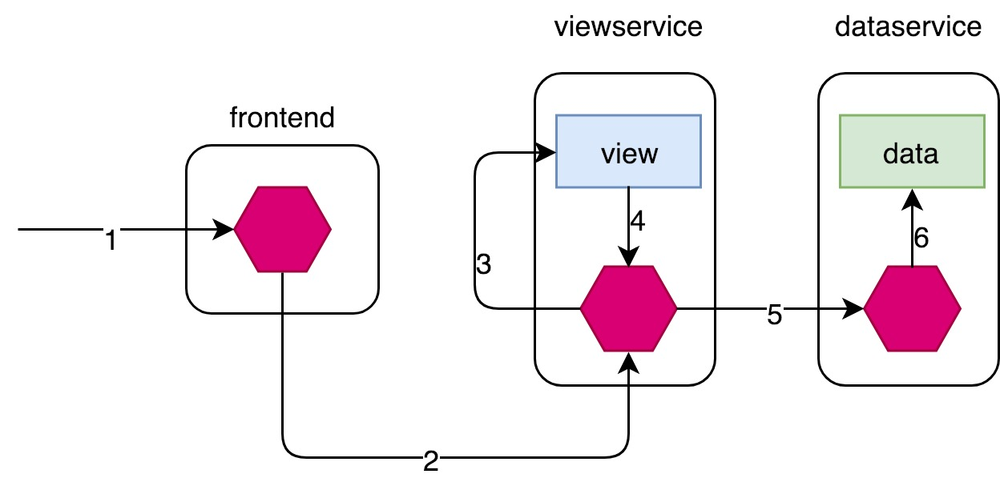
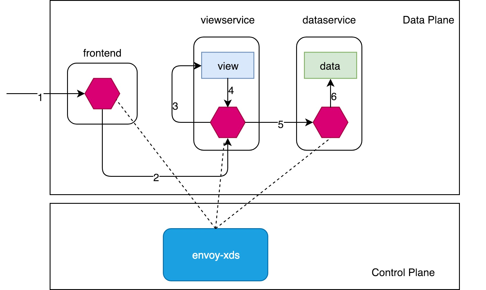

# Get started with Envoy

## What's Envoy?
Envoy is an L7 proxy and communication bus designed for large modern service oriented architectures. 

> The network should be transparent to applications. When network and application problems do occur it should be easy to determine the source of the problem.

### Why Envoy is so popular?

**Attributes that drives its uptake:**
- Performance
- Extensibility
- API configurability

**The history of Envoy API:**

**v1:**
  REST management API(CDS, RDS, LDS, SDS(changed to EDS in v2)) 
  Downside: 
  
  - JSON(not strongly typed)
  - Synchronous polling

**v2:**
  - gRPC and REST+JSON/YAML API
  - Including: EDS, CDS, RDS, LDS, HDS, ADS, KDS
  - Performance improvement: propagation time from 30–60s to 250–500ms even in large deployments

Note: The Envoy v2 APIs are defined as [proto3 Protocol Buffers](https://developers.google.com/protocol-buffers/docs/proto3) in the [data plane API repository](https://github.com/envoyproxy/data-plane-api/tree/master/envoy/api).

### What operations the v2 APIs support?

Resource are requested via **subscriptions**
The type of subscriptions:
  1. FileSystem: no ACK/NACK
  2. gRPC stream:
  3. REST-JSON: polling and no ADS support

### Bootstrap configuration

To use the v2 API, it’s necessary to supply a bootstrap configuration file. This provides static server configuration and configures Envoy to access [dynamic configuration](https://www.envoyproxy.io/docs/envoy/latest/intro/arch_overview/dynamic_configuration#arch-overview-dynamic-config) if needed. This is supplied on the command-line via the -c flag, i.e.:

```
./envoy -c <path to config>.{json,yaml,pb,pb_text}
```

A key concept in the [Bootstrap](https://www.envoyproxy.io/docs/envoy/latest/api-v2/config/bootstrap/v2/bootstrap.proto#envoy-api-msg-config-bootstrap-v2-bootstrap) message is the distinction between static and dynamic resouces. Resources such as a Listener or Cluster may be supplied either statically in [static_resources](https://www.envoyproxy.io/docs/envoy/latest/api-v2/config/bootstrap/v2/bootstrap.proto#envoy-api-field-config-bootstrap-v2-bootstrap-static-resources) or have an xDS service such as LDS or CDS configured in [dynamic_resources](https://www.envoyproxy.io/docs/envoy/latest/api-v2/config/bootstrap/v2/bootstrap.proto#envoy-api-field-config-bootstrap-v2-bootstrap-dynamic-resources).

### Example

We will deploy a sample application composed of two separate microservices: `view` and `data`. The `view` service calls the `data` service to get its data that will be displayed on browser. Also we will deploy an envoy sidecar for each microservice as well as an frontend envoy sidecar that route all ingress traffic. The whole deployment artecture can be described as below:



Note: In the following article, I will take the envoy of `data` service as an instance to describe the envoy configuration, for complete configuration of each envoy, please refer to: https://github.com/morvencao/kube-envoy-xds/tree/master/sample/deploy

#### Static

A minimal fully static bootstrap config is provided below:

```
admin:
  access_log_path: "/var/log/acces.log"
  address:
    socket_address:
      address: 0.0.0.0
      port_value: 8101
static_resources:
  listeners:
  - name: dataservice-http_listener
    address:
      socket_address:
        address: 0.0.0.0
        port_value: 8300
    filter_chains:
    - filters:
      - name: envoy.http_connection_manager
        config:
          codec_type: auto
          stat_prefix: ingress_http
          route_config:
            name: local_route
            virtual_hosts:
            - name: backend
              domains: ["*"]
              routes:
              - match:
                  prefix: "/data"
                route:
                  cluster: dataservice
          http_filters:
          - name: envoy.router
  clusters:
  - name: dataservice
    connect_timeout: 5s
    type: strict_dns
    lb_policy: round_robin
    hosts:
    - socket_address:
        address: dataservice
        port_value: 9090
```

#### XDS



A fully dynamic bootstrap configuration, in which all resources other than those belonging to the management server are discovered via xDS is provided below:

```
admin:
  access_log_path: "/var/log/acces.log"
  address:
    socket_address:
      address: 0.0.0.0
      port_value: 8101
node:
  cluster: dataservice-envoy-cluster
  id: dataservice-envoy
static_resources:
  clusters:
  - name: xds_cluster
    connect_timeout: 1s
    type: strict_dns
    lb_policy: ROUND_ROBIN
    http2_protocol_options: {}
    hosts:
    - socket_address:
        address: envoy-xds
        port_value: 15010
dynamic_resources:
  cds_config:
    api_config_source:
      api_type: GRPC
      grpc_services:
      - envoy_grpc:
          cluster_name: xds_cluster
  lds_config:
    api_config_source:
      api_type: GRPC
      grpc_services:
      - envoy_grpc:
          cluster_name: xds_cluster
```

The management server could respond to LDS requests with:

```
version_info: "0"
resources:
- "@type": type.googleapis.com/envoy.api.v2.Listener
  name: listener_0
  address:
    socket_address:
      address: 0.0.0.0
      port_value: 8300
  filter_chains:
  - filters:
    - name: envoy.http_connection_manager
      config:
        stat_prefix: ingress_http
        codec_type: AUTO
        rds:
          route_config_name: local_route
          config_source:
            api_config_source:
              api_type: GRPC
              grpc_services:
                envoy_grpc:
                  cluster_name: xds_cluster
        http_filters:
        - name: envoy.router
```

The management server could respond to RDS requests with:

```
version_info: "0"
resources:
- "@type": type.googleapis.com/envoy.api.v2.RouteConfiguration
  name: local_route
  virtual_hosts:
  - name: local_service
    domains: ["*"]
    routes:
    - match: { prefix: "/data" }
      route: { cluster: dataservice }
```

#### ADS

ADS is only available for gRPC streaming (not REST) and the whole configuration can be set to use the ADS channel:

```
admin:
  access_log_path: "/var/log/acces.log"
  address:
    socket_address:
      address: 0.0.0.0
      port_value: 8101
node:
  cluster: dataservice-envoy-cluster
  id: dataservice-envoy
static_resources:
  clusters:
  - name: xds_cluster
    connect_timeout: 1s
    type: strict_dns
    lb_policy: ROUND_ROBIN
    http2_protocol_options: {}
    hosts:
    - socket_address:
        address: envoy-xds
        port_value: 15010
dynamic_resources:
  ads_config:
    api_type: GRPC
    grpc_services:
    - envoy_grpc:
        cluster_name: xds_cluster
  cds_config:
    ads: {}
  lds_config:
    ads: {}
```


### How to implament an Evvoy management server:

`Make Before Break` principle:
	* CDS updates (if any) must always be pushed first.
	* EDS updates (if any) must arrive after CDS updates for the respective clusters.
	* LDS updates must arrive after corresponding CDS/EDS updates.
	* RDS updates related to the newly added listeners must arrive in the end.
	* Stale CDS clusters and related EDS endpoints (ones no longer being referenced) can then be removed.

#### Aggregated Discovery Services (ADS)
It's challenging to provide the guarantees on sequencing to avoid traffic drop when management servers are distributed. ADS allow a single management server, via a single gRPC stream, to deliver all API updates. This provides the ability to carefully sequence updates to avoid traffic drop. With ADS, a single stream is used with multiple independent `DiscoveryRequest/DiscoveryResponse` sequences multiplexed via the type URL. For any given type URL, the above sequencing of `DiscoveryRequest` and `DiscoveryResponse` messages applies.

### Links:

The universal data plane API: https://medium.com/@mattklein123/the-universal-data-plane-api-d15cec7a

The envoy data-plane-api README: https://github.com/envoyproxy/data-plane-api

The envoy API overview for users: https://www.envoyproxy.io/docs/envoy/latest/configuration/overview/v2_overview

The xDS protocol overview: https://github.com/envoyproxy/data-plane-api/blob/master/XDS_PROTOCOL.md
